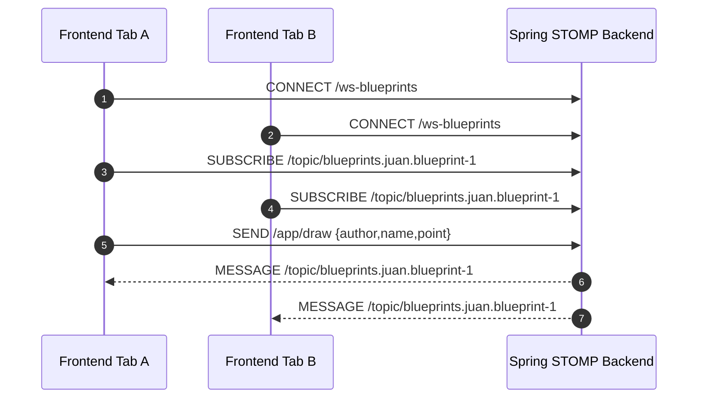

# STOMP Backend for BluePrints Real-Time Collaboration

<div align="center">


Reference Spring Boot backend used by the P4 front-end for topic-based real-time synchronization.

</div>

---

## Core capabilities

- STOMP-over-WebSocket endpoint (`/ws-blueprints`).
- Topic-based collaboration per blueprint (`/topic/blueprints.{author}.{name}`).
- Message mapping endpoint for draw events (`/app/draw`).

---

## Architecture

```mermaid
flowchart LR
  FE[React Front-end] -->|WebSocket/STOMP| WS[/ws-blueprints]
  FE -->|publish /app/draw| CTRL[@MessageMapping draw]
  CTRL -->|convertAndSend| TOPIC[/topic/blueprints.author.name]
  TOPIC --> FE
```

### Message sequence



---

## Run locally

```bash
mvn spring-boot:run
```

Defaults:

- HTTP: `http://localhost:8080`
- WS endpoint: `/ws-blueprints`

---

## Build verification

```bash
mvn -B verify
```

---

## Front-end integration

In front-end `.env.local`:

```bash
VITE_STOMP_BASE=http://localhost:8080
```

In the UI, select `STOMP (Spring)` transport.

---

## Screenshot evidence suggestions

1. `stomp-01-app-startup.png`
   - Spring Boot startup logs and mapped WebSocket endpoint.
2. `stomp-02-topic-subscription.png`
   - Browser/network evidence of successful STOMP subscribe.
3. `stomp-03-live-sync-two-tabs.png`
   - Two tabs showing replicated points with STOMP mode.
4. `stomp-04-maven-and-sonar-pass.png`
   - Successful Maven verify + SonarCloud workflow.

---

## License

MIT [LICENSE](LICENSE)
