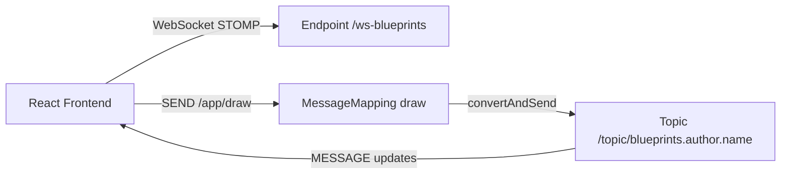
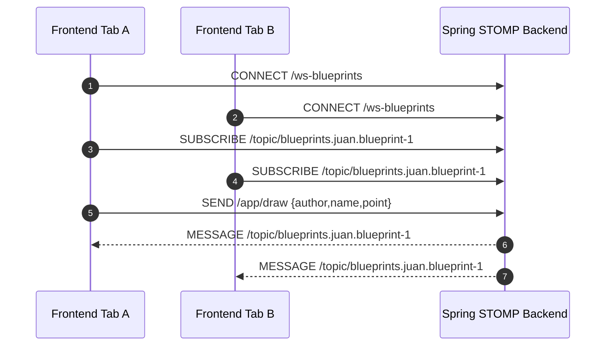

# STOMP Backend - Render-Safe and Production-Style Documentation

<div align="center">


Spring Boot realtime backend for Lab P4 with topic-based collaborative drawing.

</div>

---

## Table of contents

- [Purpose](#purpose)
- [Core capabilities](#core-capabilities)
- [Architecture](#architecture)
- [Message flow](#message-flow)
- [Run guide](#run-guide)
- [Build verification](#build-verification)
- [Frontend integration](#frontend-integration)
- [Screenshot evidence kit](#screenshot-evidence-kit)

---

## Purpose

This project implements the STOMP model for realtime collaboration:

- browser clients connect through WebSocket endpoint
- clients publish draw events
- backend routes updates to topic subscribers

---

## Core capabilities

- WebSocket endpoint: `/ws-blueprints`
- Publish endpoint: `/app/draw`
- Topic stream: `/topic/blueprints.{author}.{name}`
- Payload relay for live canvas synchronization

---

## Architecture



### Why this Mermaid is render-safe

- Quoted node labels avoid parser conflicts.
- No special symbols in node IDs.
- Connection labels are wrapped in quotes.

---

## Message flow



---

## Run guide

```bash
mvn spring-boot:run
```

Defaults:

- HTTP base: `http://localhost:8080`
- WebSocket endpoint: `/ws-blueprints`

---

## Build verification

```bash
mvn -B verify
```

---

## Frontend integration

Use in front-end `.env.local`:

```bash
VITE_STOMP_BASE=http://localhost:8080
```

Then choose **STOMP (Spring)** in the front-end transport selector.

---

## Screenshot evidence kit

| File name | Recommended capture |
|---|---|
| `stomp-01-spring-startup.png` | Spring startup logs with WebSocket config |
| `stomp-02-stomp-connect.png` | Browser network showing STOMP connection |
| `stomp-03-topic-subscribe.png` | Subscription frame to topic |
| `stomp-04-draw-send-frame.png` | SEND frame to /app/draw |
| `stomp-05-topic-message-frame.png` | MESSAGE frame received from topic |
| `stomp-06-two-tabs-sync.png` | Two tabs showing synchronized canvas |
| `stomp-07-maven-verify-pass.png` | Maven verify successful output |
| `stomp-08-sonar-pass.png` | SonarCloud workflow passed |

---

## License

MIT [LICENSE](LICENSE)
