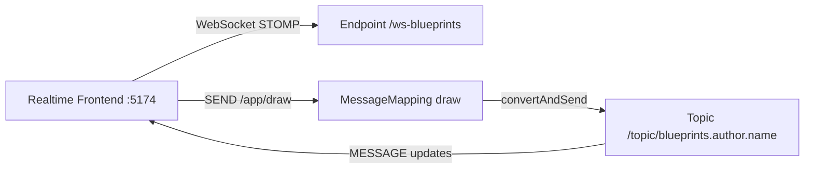
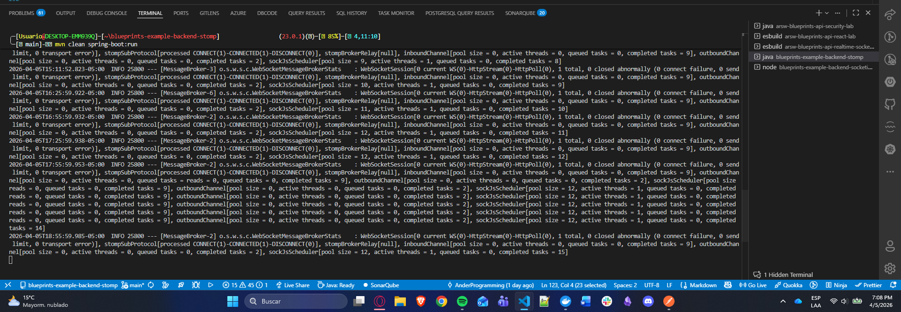
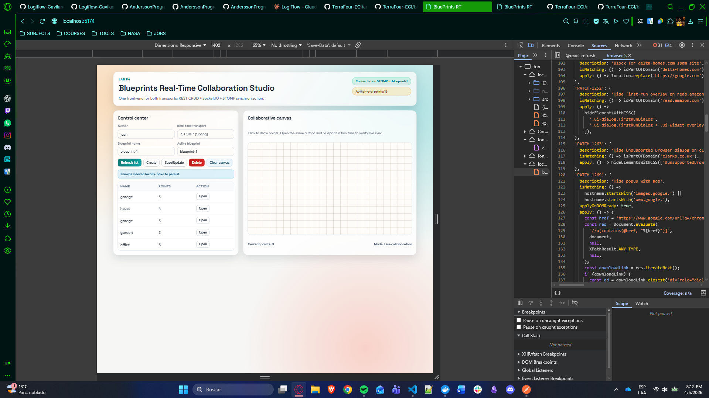
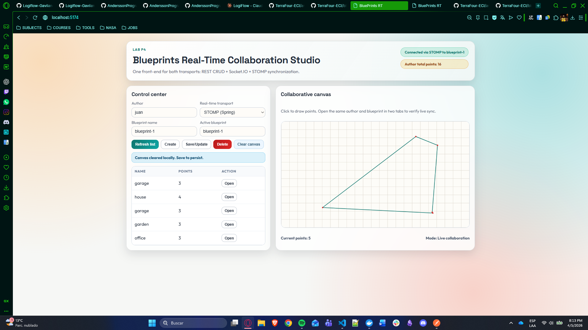
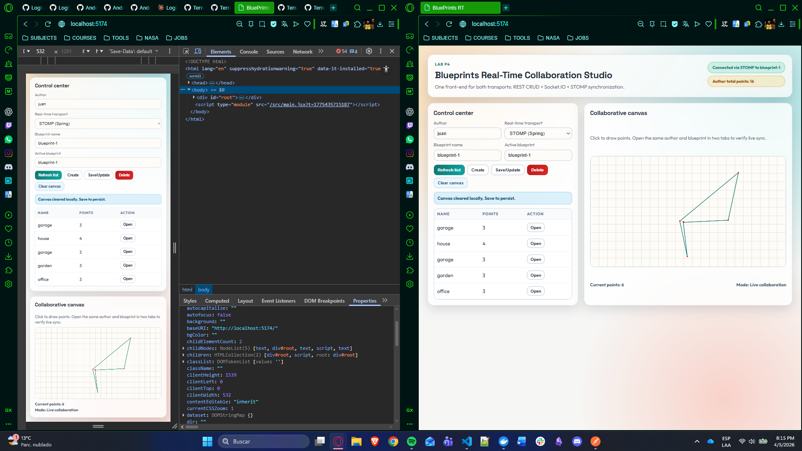
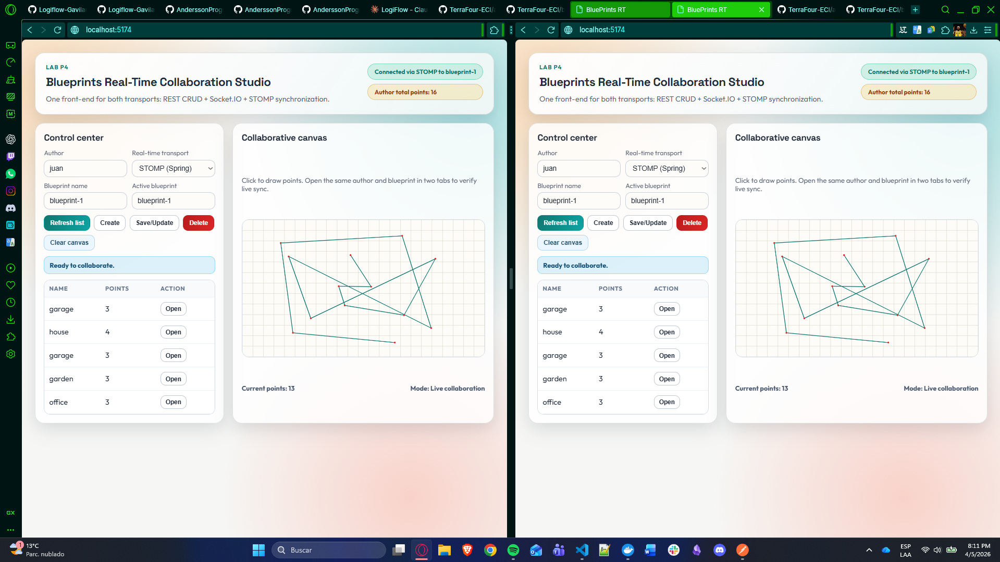
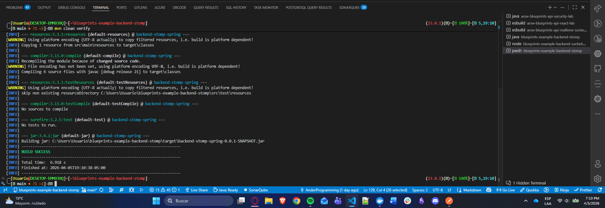
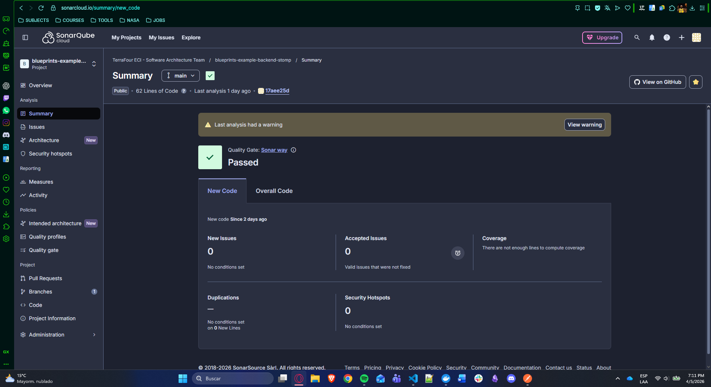

# 📡 STOMP Backend - Final Evidence README

<div align="center">


Topic-based realtime backend used by the central P4 frontend.

</div>

---

## 🎯 Purpose

This backend handles STOMP/WebSocket collaboration:

- websocket connection endpoint
- draw event publishing endpoint
- topic broadcasts for blueprint sessions

---

## 🧩 Core contracts

- WebSocket endpoint: `/ws-blueprints`
- Publish destination: `/app/draw`
- Subscribe topic: `/topic/blueprints.{author}.{name}`

---

## 🏗️ Architecture (render-safe Mermaid)



---

## ▶️ Run

```bash
mvn spring-boot:run
```

Default service URL: `http://localhost:8080`

In your integrated flow you can run this backend on `8081` and point the frontend accordingly.

---

## 📸 Evidence gallery

### 01 - Spring startup
Application boot and endpoint initialization.



### 02 - STOMP connection established
WebSocket/STOMP client connection evidence.


### 03 - Topic subscription
Frontend subscribed to blueprint topic.



### 04 - Draw SEND frame
Frontend publish event to `/app/draw`.



### 05 - MESSAGE frame received
Broadcast from backend to subscribers.



### 06 - Two-tab sync
Visual synchronization proof with STOMP mode.



### 07 - Maven verify pass
Local build/verification evidence.



### 08 - Sonar pass
CI quality analysis evidence.



---

## 🔗 Integration note

Set this in realtime frontend `.env.local`:

```bash
VITE_STOMP_BASE=http://localhost:8081
```

---

## 📄 License

MIT [LICENSE](LICENSE)
